# Capturas del Sistema Recomendador

App React (Vite + react-force-graph-3d + Plotly). Para reproducir:
`pnpm dev` en `ver_grafos/app` tras generar los datos con
`venv\Scripts\python.exe ver_grafos\generar_grafos_3d.py --json`.

## Visualizaciones 3D

### 1. Red Neuronal 3D — Arquitectura Torre Doble
Grafo real de las capas del modelo Two-Tower entrenado (introspección Keras),
coloreado por torre: azul = usuario, naranja = producto, verde = fusión/salida.
Arrastrable, con flujo de partículas entre capas.

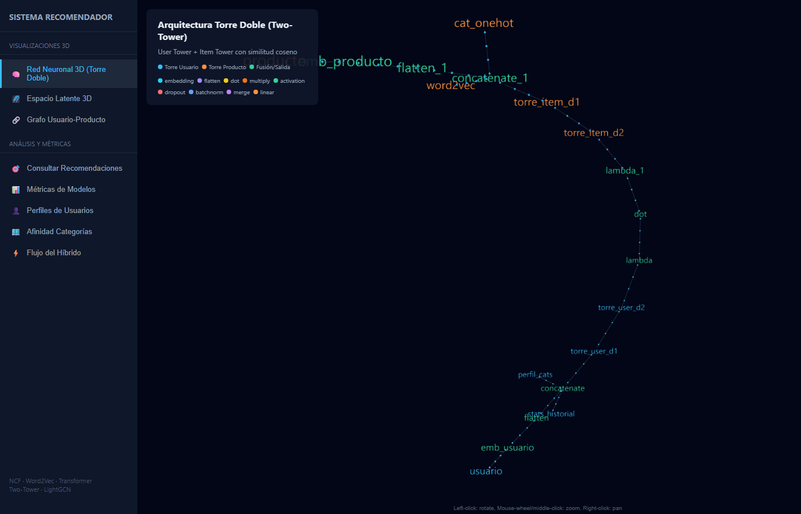

### 2-5. Espacio Latente de Productos (4 métodos comparables)
Un solo visor con selector de método; puntos cercanos = productos similares:

| Método | Origen del embedding |
|---|---|
| NCF | filtrado colaborativo (red neuronal) |
| Word2Vec | títulos/descripciones (100D → PCA) |
| Semántico Transformer | Sentence-BERT multilingüe (384D → PCA) |
| LightGCN | propagación sobre grafo usuario-producto |

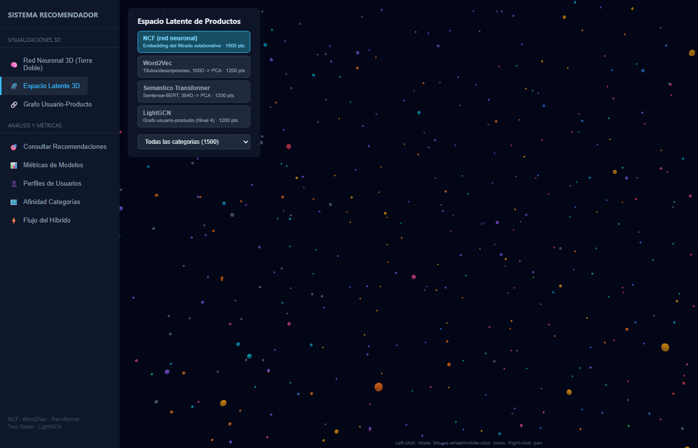
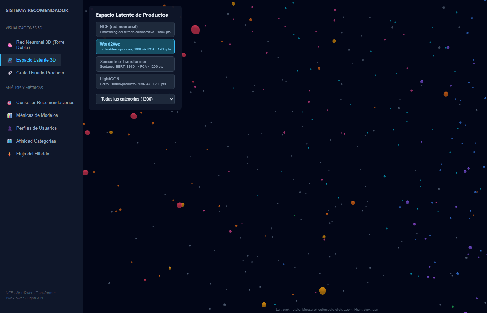
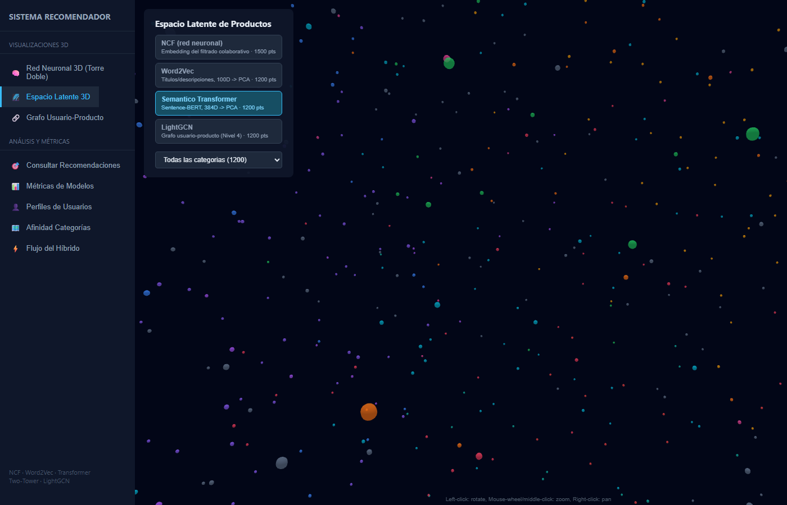
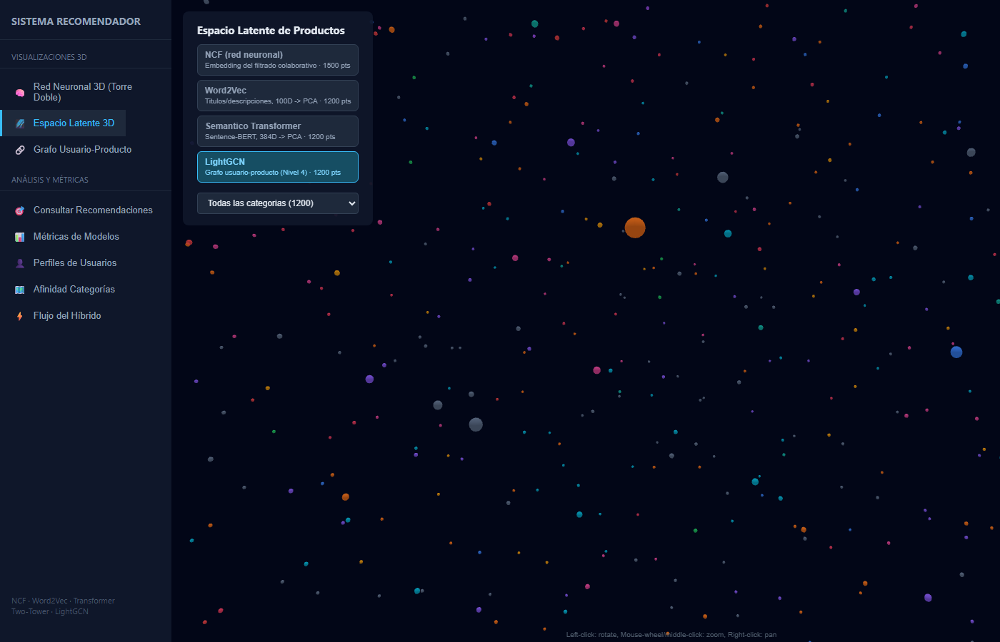

### 6. Grafo Usuario-Producto
Bipartito: cada usuario conectado a sus categorías de mayor afinidad predicha.

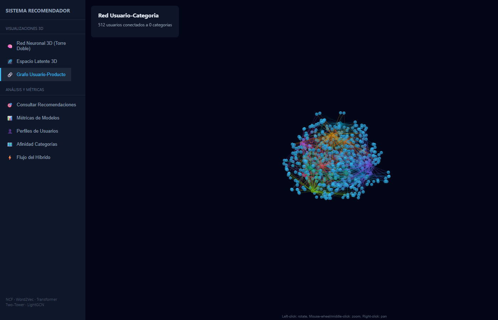

## Análisis y métricas

### 7. Consultar Recomendaciones
Seleccionas un usuario (búsqueda por nombre o código) y el Híbrido V5 muestra
su perfil, últimas compras (con color/talla en productos de moda) y Top-10 con
barras apiladas que indican cuánto votó cada componente.

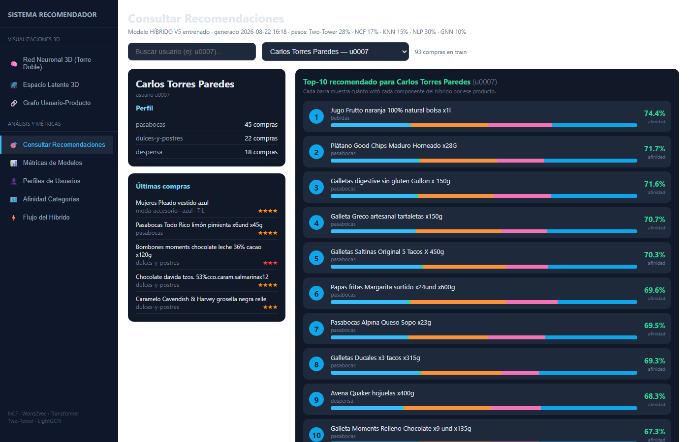

### 8. Métricas de Modelos
Tabla unificada (split SEED=42) de los 8+ modelos y comparativa histórica.

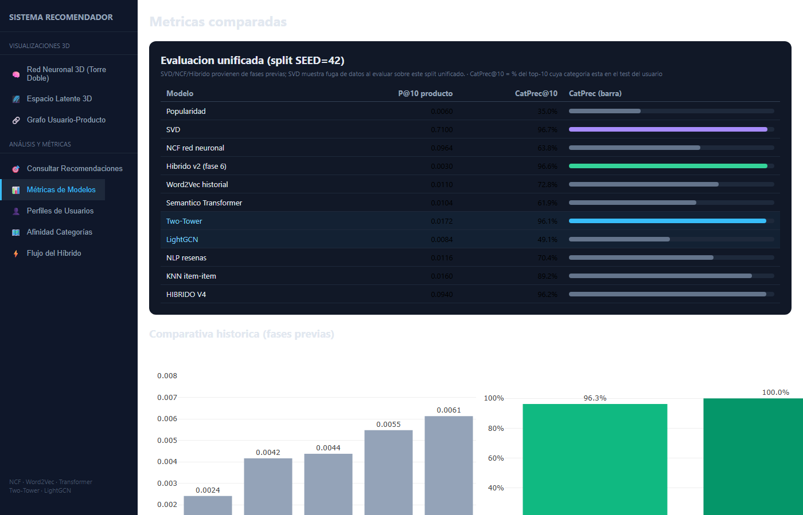

### 9. Perfiles de Usuarios
Historial, ratings y preferencias de los usuarios demo.

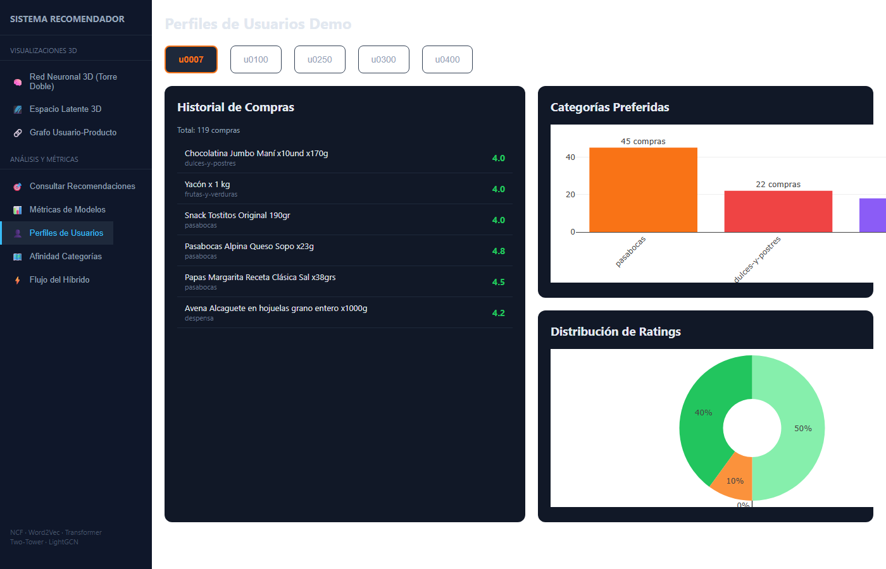

### 10. Afinidad Categorías
Heatmap 500 usuarios × categorías del predictor + top-3 para usuarios demo.

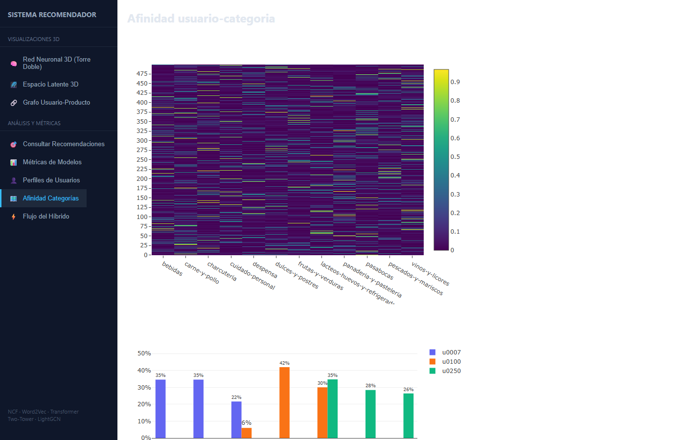

### 11. Flujo del Híbrido V5
Pipeline completo: DATOS → embeddings NLP → Two-Tower/LightGCN/NCF →
HÍBRIDO V5 → ranking → TOP-10.

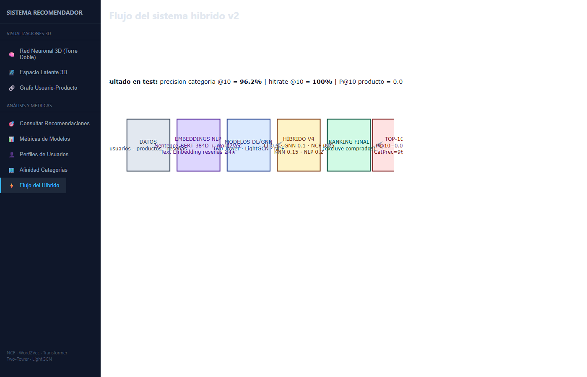
